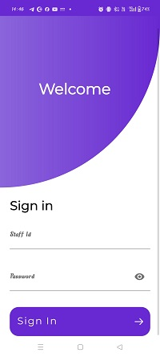
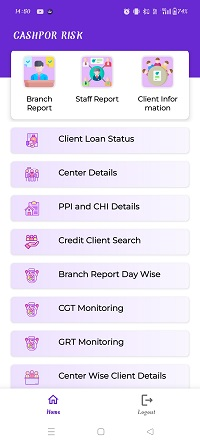
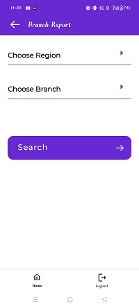
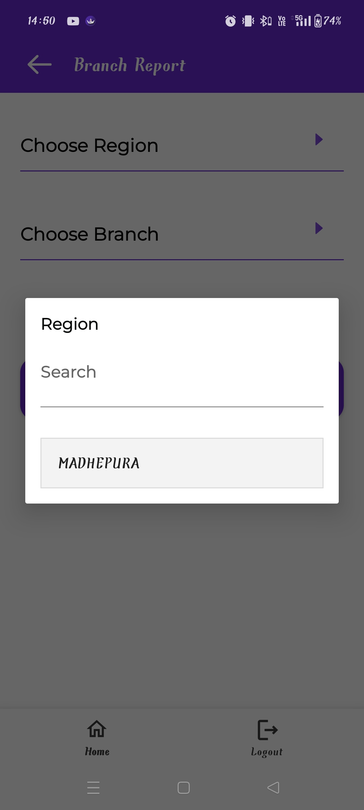
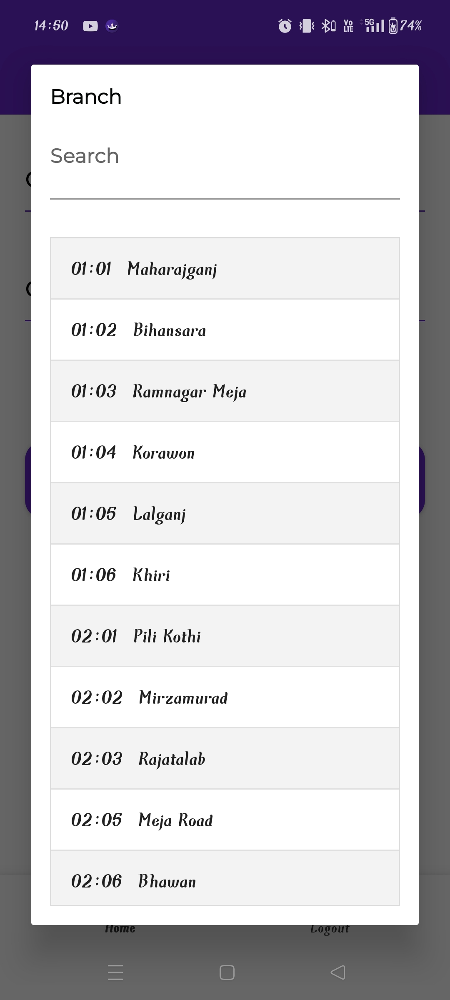
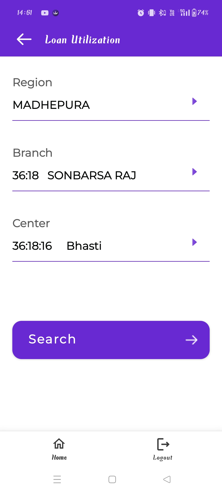
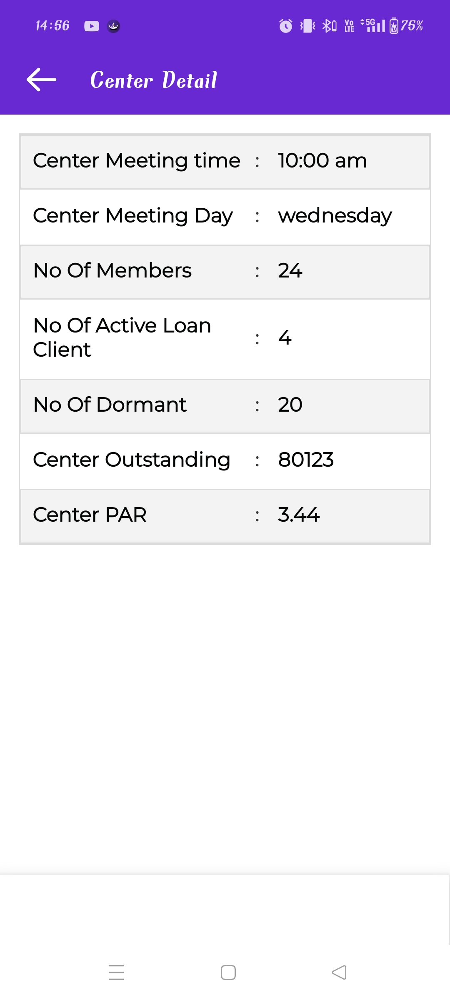
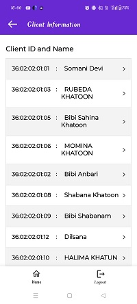
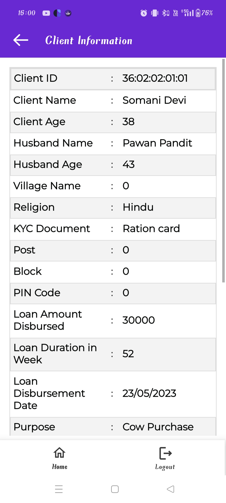

# Cashpor Risk Loan Management System

An Android‑based Loan Management System built with Java and Material Design components. Cashpor Risk helps branch staff manage loans, view reports, search clients, and monitor collections—all from a single, responsive mobile app.

---

## Table of Contents

- [Features](#features)  
- [Screenshots](#screenshots)  
- [Usage](#usage)  
- [Technologies Used](#technologies-used)  

---

## Features

- **Secure Login** — Staff authentication via Staff ID & Password  
- **Dashboard** — Quick access to branch & staff reports, client information  
- **Client Loan Status** — Check outstanding loans & repayment schedules  
- **Center Details** — View center‑wise client lists and performance  
- **PPI & CHI Details** — Insurance and health information panels  
- **Credit Client Search** — Find clients by name or ID  
- **Day‑Wise Branch Report** — Daily disbursement & collection summaries  
- **CGT / GRT Monitoring** — Monitor group guarantees & risk metrics  
- **Center‑Wise Client Details** — Drill into each center’s client data  
- **Logout** — Securely end your session  

---

## Screenshots

### 1. Sign In Screen
Staff enter their credentials to access the app.

  

---

### 2. Main Dashboard
From here you can navigate to all reports and client modules.

  

---
### 📍 Branch & Region Selection
- Select region & branch to filter reports and monitor data.

---

### 📊 Loan Utilization Filter
- Select Region > Branch > Center to view client-level loan status.

### 🏘️ Center List
Center-wise listing with center ID and name.

---

### 📋 Center Details
Detailed center metrics:  
- Meeting Time/Day  
- Active Loan Clients  
- Dormant Clients  
- Outstanding Loan Amount  
- Center PAR

### 👤 Client List View
- Searchable list of all registered clients in the branch/center.

---

### 📑 Individual Client Details
Includes full loan information, family details, KYC, and disbursement status.

### Prerequisites

- Android Studio **Arctic Fox** or newer  
- Android SDK **API Level 21+**  
- Java Development Kit **1.8+**  

